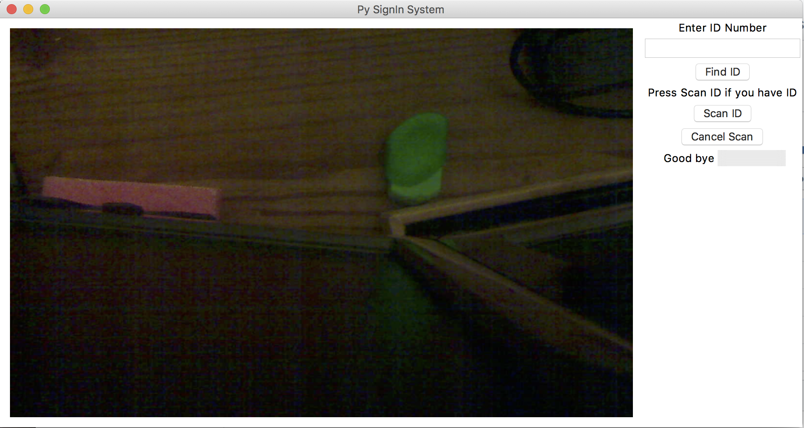
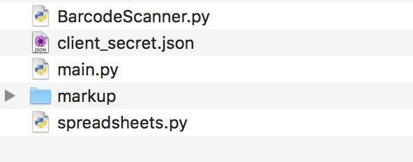

#FRC Team 2643 Sign In System 

This system was built to keep track of hours each member spent during the 2018 Build Season FIRST Robotics competition

The script was made to be used with a raspberry pi using the full desktop version of [raspbian](https://www.raspberrypi.org/downloads/raspbian/) as well as a usb camera 

> Written in Python 3.6.2; however, support for Python 2 is unknown


##Requirements to running this script

You will only need three of the files to run the script `spreadsheets.py` `BarcodeScanner.py` `main.py` 

> I may combine the three scripts into one file

###Furthermore
***
There are a few necessary modules to run the program

>the shell code only applies if you have only python 3 installed, if not you will need to us `pip3 install` to correctly install the modules

* gspread and oauth2client from Google API `pip install gspread oauth2client`
* Pillow `pip install Pillow ` 
* opencv 3 `pip install opencv-python`
* numpy `pip install numpy`
* zbar `pip install zbar-py`

> Also you can install all by just using this
```
pip install Pillow numpy gspread imutils opencv-python zbar-py oauth2client
```

***

##Setup
1. Setup a worksheet with 3 spreadsheets in google spreadsheet
> your first 2 spreadsheets should resemble with row 4 acting as a divider
>
| Last Name | First Name  | Student ID  |    | 1/1  | 1/2  | etc |
|:----------|:-----------:|:-----------:|:--:|:----:|:----:|----:|
|Smith      | John        |55555555     |    |      |      |     |
|Generic    | Jill        |55555556     |    |      |      |     |
>your last sheet should look something like this
>
| Last Name | First Name  | Student ID  |    | total time|
|:----------|:-----------:|:-----------:|:--:|----------:|
|Smith      | John        |55555555     |    |           |
|Generic    | Jill        |55555556     |    |           |

2. Go to google api [developer credentials](https://console.developers.google.com/apis/credentials?project=nodal-unity-190607) and create a new service account key as an editor,  rename the file to `client_secret.json`, and put the file in the same folder as your other files 
>
3. Open the `client_secret.json` and copy the client email in the file which looks something like this
>```
>"client_email": "clientEditor@nodal-unity-11111.iam.gserviceaccount.com",
>```
4. On your google spreadsheet, share the file to the `"client_email"` from the `client_secret.json` in the previous step
5. Open `main.py` and look for and `self.s = spreadsheet("test")` by adding your worksheet file title instead of `"test"` which is located on line 44
>```python
>42 	self.read = readBarcode()
>43 	self.results = ""
>44		self.s = spreadsheet("YOUR FILE NAME HERE") #place worksheet title here
>45
>46		self.stopEvent= threading.Event()
>```
6. If you already have a camera on the pi or any other device and don't want to use that camera, then change `cap = cv2.VideoCapture(0)` on line 151 to `1` or any other number instead of `0` (built or first camera plugged in)
> ```python
> 149	#1 is for usb camera on a computer with a webcam builtin,
> 150	#0 is for the first camera
> 151	cap = cv2.VideoCapture(1)
> ```
7. You can either run the script in idle or in terminal.
> To run the script in idle, open `main.py` the file in idle and go to the drop down menu Run and run module or use F5.
> 
> To run in terminal, open the terminal and `cd` into your folder
> then run the code using `python main.py` or `python3 main.py` if you have python 2 installed

